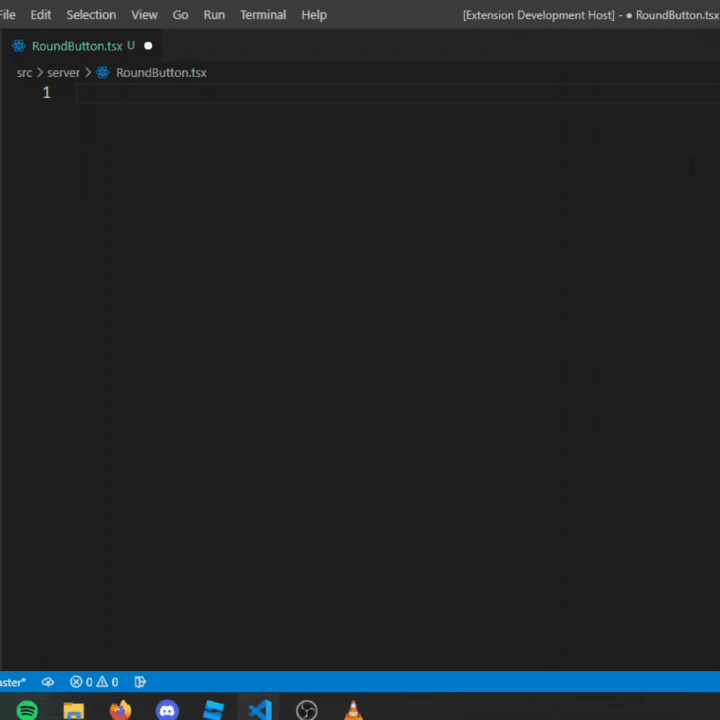

    
    <h1>Roact Snippets</h1>

## Warning

If you installed React snippets, please disable it before using this extension otherwise it will overwrite the snippets and can have issues later on.

## Usage

When using Luau:

---

When using TSX (with roblox-ts):

## Snippets

Below is a list of available snippets and the triggers of each one.
Seperated with Lua and TSX

### TSX:

| Trigger | About                                              |
| ------- | -------------------------------------------------- |
| `rfc`   | Function component                                 |
| `rfcp`  | Function component with props configured           |
| `rpc`   | Pure component                                     |
| `rpcp`  | Pure component with props configured               |
| `rpcsp` | Pure component with props and state configured     |
| `rcc`   | Stateful component                                 |
| `rccp`  | Stateful component with props configured           |
| `rccsp` | Stateful component with props and state configured |

---

### Luau:

| Trigger         | About                                          |
| --------------- | ---------------------------------------------- |
| `element`       | Shortcut for Roact.createElement               |
| `fragment`      | Shortcut for Roact.createFragment              |
| `context`       | Shortcut for Roact.createContext               |
| `componentinit` | Shortcut for Component:init() function         |
| `shouldUpdate`  | Shortcut for Component:shouldUpdate() function |
| `willUpdate`    | Shortcut for Component:willUpdate() function   |
| `didUpdate`     | Shortcut for Component:didUpdate() function    |
| `didMount`      | Shortcut for Component:didMount() function     |
| `willUnmount`   | Shortcut for Component:willUnmount() function  |
| `setstate`      | Shortcut for self:setState({}) function        |
| `state`         | Shortcut for self.state                        |
| `props`         | Shortcut for self.props                        |
| `rcc`           | Stateful component                             |
| `rfc`           | Function component                             |
| `rpc`           | Pure component                                 |
